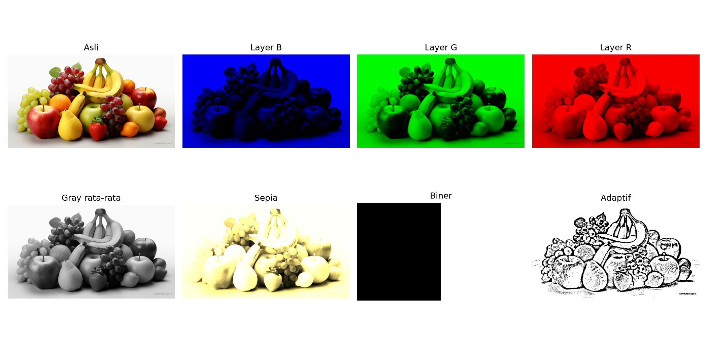
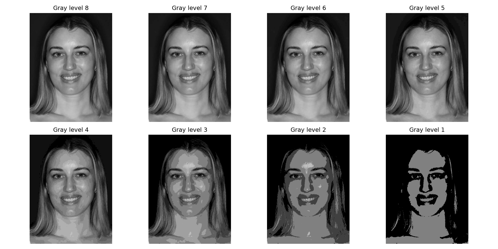
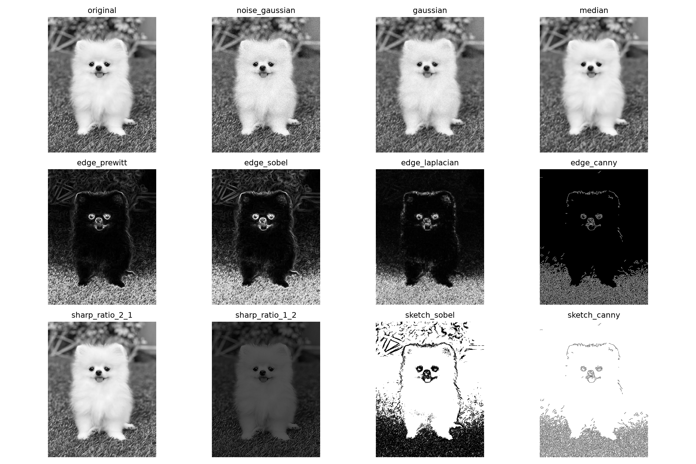

<div align="center">

# Computer Vision Course

### Praktikum pengolahan citra interaktif dengan Python dan OpenCV

[](https://www.python.org/)
[](https://opencv.org/)
[](LICENSE)

Kumpulan Praktikum 02–08 Computer Vision dengan GUI interaktif, mode batch, dataset siap pakai, dan hasil eksperimen yang dapat disimpan.

</div>

---

## Preview

| Manipulasi warna | Kuantisasi | Filtering dan deteksi tepi |
|:---:|:---:|:---:|
|  |  |  |

## Fitur

- GUI bertema gelap dengan perbandingan citra asli dan hasil secara langsung.
- Galeri berisi sembilan citra dengan karakteristik berbeda.
- Slider parameter interaktif untuk threshold, rotasi, brightness, contrast, gamma, blur, noise, dan operasi lain.
- Hasil dapat disimpan langsung dari GUI.
- Tombol **Jalankan semua eksperimen** untuk menghasilkan seluruh keluaran praktikum.
- Mode batch untuk eksperimen otomatis tanpa membuka GUI.
- Operasi aman terhadap overflow melalui clipping sebelum konversi ke `uint8`.

## Materi

| File | Materi utama |
|---|---|
| `praktikum_02.py` | Akses piksel, copy, flip horizontal/vertikal, rotasi 90° dan rotasi bebas |
| `praktikum_03.py` | Kanal BGR, grayscale, sepia, threshold global dan adaptif |
| `praktikum_04.py` | Threshold dan kuantisasi grayscale/warna 1–8 bit |
| `praktikum_05.py` | Brightness, contrast, invers, gamma, log, inverse-log, root, spektrum Fourier |
| `praktikum_06.py` | Histogram transformasi, autolevel grayscale dan per kanal BGR |
| `praktikum_07.py` | Histogram equalization, CDF, autolevel, dan CLAHE |
| `praktikum_08.py` | Noise, reduksi noise, konvolusi, Prewitt, Sobel, Laplacian, Canny, sharpness, sketsa |

## Instalasi

Pastikan Python 3.10 atau versi yang lebih baru sudah terpasang.

```bash
git clone https://github.com/ausartal/computer-vision-course.git
cd computer-vision-course

python -m venv .venv
```

Aktifkan virtual environment:

```powershell
# Windows PowerShell
.venv\Scripts\Activate.ps1
```

```bash
# Linux/macOS
source .venv/bin/activate
```

Instal dependensi:

```bash
python -m pip install -r requirements.txt
```

> Pada Linux, Tkinter mungkin perlu dipasang terpisah, misalnya `sudo apt install python3-tk` pada Ubuntu/Debian.

## Menjalankan GUI

Jalankan file praktikum yang ingin dicoba:

```bash
python praktikum_02.py
```

Di dalam GUI:

1. Pilih gambar dari menu **Dataset** atau tekan **Buka gambar lain**.
2. Pilih algoritma pada menu **Operasi**.
3. Geser parameter dan amati hasil secara langsung.
4. Tekan **Simpan hasil** untuk menyimpan preview aktif.
5. Tekan **Jalankan semua eksperimen** untuk menghasilkan seluruh keluaran praktikum.

## Mode batch

Mode batch cocok untuk terminal, otomasi, atau lingkungan tanpa display:

```bash
python praktikum_08.py --batch --input "data/Dog_Image.jpg"
```

Argumen `--input` opsional. Bila tidak diberikan, program memilih salah satu dataset bawaan. Hasil disimpan otomatis ke:

```text
output/praktikum_XX/
```

## Struktur repository

```text
computer-vision-course/
├── assets/
│   └── previews/          # Gambar preview untuk dokumentasi
├── data/                  # Dataset citra siap pakai
├── common.py              # Loader, autolevel, dan utilitas penyimpanan
├── vision_gui.py          # GUI bersama dan transformasi interaktif
├── praktikum_02.py
├── praktikum_03.py
├── praktikum_04.py
├── praktikum_05.py
├── praktikum_06.py
├── praktikum_07.py
├── praktikum_08.py
├── requirements.txt
└── LICENSE
```

## Dataset

Repository menyertakan citra apel, arsitektur, blok warna, kucing, anjing, wajah dengan dua kondisi pencahayaan, buah, dan panorama. Variasi tersebut membantu memperlihatkan bahwa satu algoritma dapat memberi hasil berbeda tergantung warna, detail, kontras, dan pencahayaan citra.

Anda juga dapat menggunakan gambar sendiri melalui GUI atau argumen `--input`.

## Catatan pembelajaran

- Nilai parameter terbaik tidak selalu sama untuk setiap gambar.
- Histogram equalization dapat meningkatkan kontras global, sedangkan CLAHE lebih terkontrol secara lokal.
- Median filter biasanya efektif untuk salt-and-pepper noise; Gaussian filter lebih sesuai untuk noise yang menyebar.
- Sobel memberi bobot lebih besar pada piksel dekat pusat kernel sehingga umumnya lebih stabil terhadap noise dibanding Prewitt.
- Kuantisasi dengan bit lebih rendah menghasilkan tingkat warna lebih sedikit dan efek posterisasi lebih kuat.

## Lisensi

Proyek ini tersedia di bawah [GNU General Public License v3.0](LICENSE).

